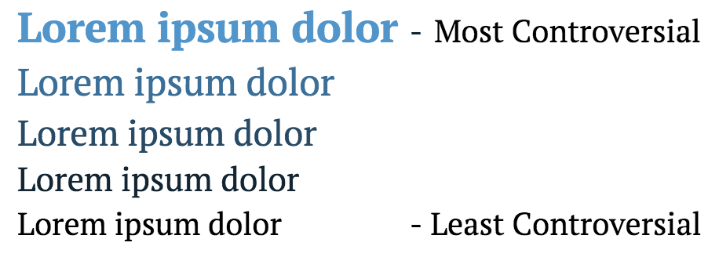
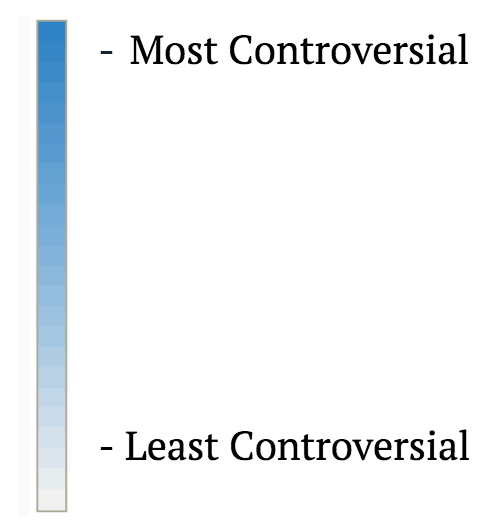

## This contains the software needed to create the visualization based off of the wiki2graph output.

### To see a small example of this visualization:

full screen: https://run.plnkr.co/plunks/WJERK0NM5uwPejvLtNTw/

to see code: https://plnkr.co/edit/WJERK0NM5uwPejvLtNTw?p=info

### About the visualization

We are using color to encode the controversy metrics found from metric.py.

The visualization can be broken down into 3 parts:

- The text of the article

.

- The overall timeline of the article

.

- The section timeline of the article

you can navigate by clicking on the timeline, in order to see the article from that date.

by clicking "Overview" you will see a matrix visualization consisting of subsections from the article over time.

clicking anywhere on this matrix will link you back to the respective article from that date.

clicking on the article name in the top left will open the article on wikipedia.

### To run this yourself and create your own visualizations:

- you will need to have multiple versions of articles with time stamps in the format of  _Blizzard2017-03-30.html.

- these should be contained in a directory named after the article such as visualization/Blizzard/.

- you need the file "d3-timeline.js" in the visualization directory. you can get it here: https://github.com/jiahuang/d3-timeline/tree/master/src.

- run:

      python processHTML.py [ article name ] [ article directory ]
 

To see the visualization properly on your local machine, you need to create a local web server within the visualization directory.

You can use python:

      python -m SimpleHTTPServer 8000
      
For python 3.x:

      python -m http.server 8000

Getting this to work can be tricky depending on your browser configurations.

      
